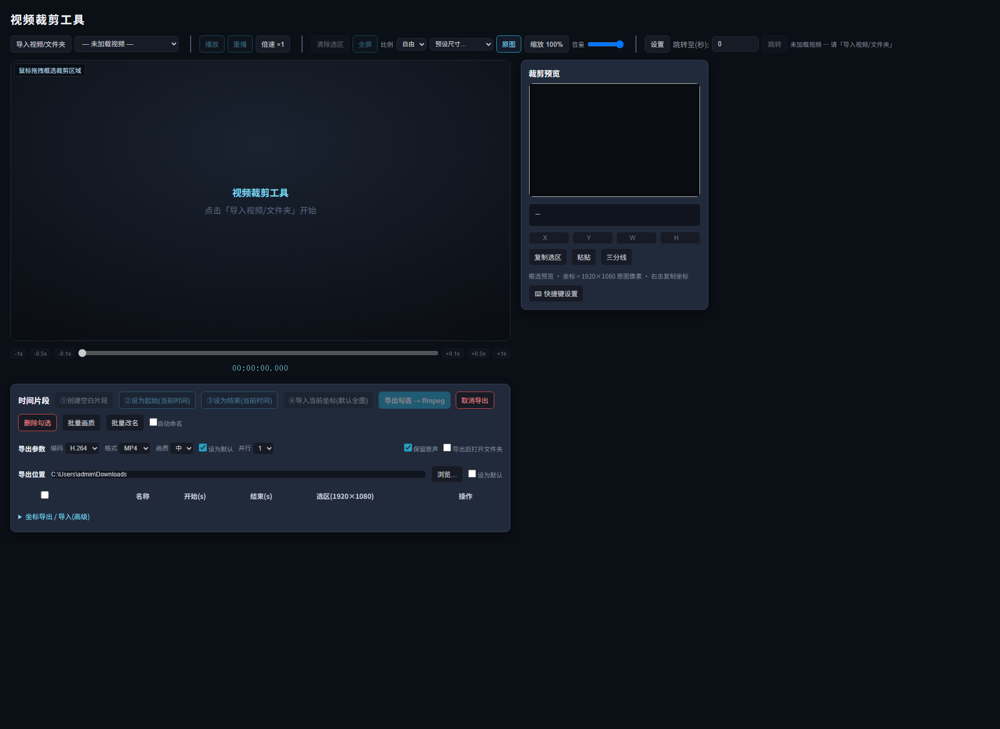

# 视频裁剪工具

通用的本地视频裁剪工具：框选区域 + 起止时间，用本地 ffmpeg 直接裁出视频片段。无内置视频库，视频全部手动导入。

## 文件

| 文件 | 说明 |
|---|---|
| `index.html` | 裁剪工具界面（自包含，无外部依赖） |
| `start_server.py` | 本地服务器（静态服务 + 文件浏览 + 上传 + ffmpeg 裁剪 API） |
| `start.bat` | Windows 一键启动（开默认浏览器 + 跑服务器） |
| `LICENSE` | MIT 许可 |

## 使用

1. **启动**：双击 `start.bat`（或 `python start_server.py`），浏览器自动打开 `http://127.0.0.1:8003/`。
2. **导入视频**：点「导入视频/文件夹」浏览任意目录；或**直接把视频文件拖进窗口**自动上传导入。可多导入，用下拉框切换，「取消导入」移除当前。
3. **框选裁剪区域**：拖拽框选（选区外自动变暗），四角控制点可微调；坐标按 1920×1080 原图像素显示。
4. **定时间片段**（4 按键流程）：①创建空白片段 → ②设为起始 → ③设为结束 → ④导入当前选区；**表格行可拖拽排序**，时间轴色块**双击跳转**。
5. **导出**：编码/格式/画质/并行数可调，勾选「导出后打开文件夹」完成后自动打开目录；导出有进度条 + 完成/失败 toast 通知。
6. **批量**：全选/批量删除/批量画质/**批量改名**（片段1/2/3…）；每行「⋯」菜单可复制/清空时间/置顶/删除。
7. **坐标持久化**：导出 JSON/CSV，导入恢复（导入前有预览确认）。
8. **快捷键**：「设置」里自定义（空格播放、←/→ 步进、Ctrl+Z 撤销/重做、Ctrl+Y 重做等）。

## 依赖

- Python 3（标准库即可，无第三方依赖）
- ffmpeg（已安装并在 PATH 中；或通过 `pip install imageio-ffmpeg` 自动提供）

## ⚠️ 安全与平台说明

- **仅限本机使用**：服务器默认只绑定 `127.0.0.1`（不对外网开放）。
- **可读写任意本地文件**：`/api/fs`（浏览目录）、`/api/stream`（读取视频）、`/api/crop`（写入导出文件）按设计可访问本机任意路径。**不要**把它部署到公网、不要绑定 `0.0.0.0`、不要在不可信网络环境运行。
- **拖入导入会复制文件**：把视频拖进窗口会把文件复制到项目 `上传/` 目录再导入（浏览器安全限制拿不到原路径）；大文件建议用「导入视频/文件夹」直接引用原路径，不占双份空间。
- 端口默认 **8003**（可用 `python start_server.py <端口>` 改）。
- Windows 优先（界面/`start.bat`/Downloads 探测按 Windows 习惯），但 `start_server.py` 用纯 Python 标准库，macOS/Linux 也可直接 `python start_server.py` 运行（需另装 ffmpeg，`list_drives` 在非 Windows 下返回空，不影响功能）。
- 浏览器不要直接双击 `index.html`（`file://` 会因跨域无法导入/裁剪），必须经服务器访问。
- 导出默认目录 = **浏览器下载目录**（Windows 的 Downloads）；工具「导出位置」里可改并「设为默认」。

## 修改后看不到新效果？

浏览器可能缓存旧版：**Ctrl+F5 强制刷新**，或 F12 → Network → 勾选 Disable cache，或换无痕窗口。
